# EML 6351 Simulation Project 1

* ### **Introcuction** 
In this project, we need to design our own traditional adaptive controller (with gradient adaptive update law), and 2 composite adaptive controllers (with gradient adaptive update law and least squares adaptive update law) for a two-link rigid revolute robot manipulator, to make sure the actual angular position of each joints can keep track of the desired angular position.  
The robot manipulator model is as below:

where: 

  
  

* ### **Derive the filter torque , the filtered regression matrix  and the filtered desired regression matrix .**
#### 1. Filtered torque .  
   
 is known and designed by us, and  is f convolved with .  f designed as . After Laplacian transform, we will have .  

#### 2. Filtered regression matrix .  

First, we have &nbsp; , and after some mathematics processes, we can derive them into a form as below:  

  

with &nbsp; , and &nbsp; . After initialize   and , we can get , and factor out the theta, we can have .

#### 3. filtered desired regression matrix .

We can get  as follow:  

   
  
Where  &nbsp;   is derived beforehand:  

 
 
  
 
 
 
 
  
 
 
 
 &nbsp; is designed by us, so we can intergrate  &nbsp; with initilization to get .  

* ### **Derive and simulate the controllers**

**(a) Traditional adaptive controller with gredient adaptive update law.**  

The code is included in 'traditional.m', and to implement it, just hit run button or implement the traditional function in command window.  

**(b) Composite adaptive controller with gredient adaptive update law.**

The code is included in 'torquefiltermethod.m', and to implement it, just hit run button or implement the torquefiltermethod function in command window. 

**(c) Composite adaptive controller with least squares adaptive update law.**

The code is included in 'leastsquaremethod.m', and to implement it, just hit run button or implement the leastsquaremethod function in command window. 

**(d) turn in the code**
All the codes are in src file and can be implemented by themselves in Matlab (no dependent needed).

-------------------------------
* ### **Typed report**
  
**(a) Dynamics model.**  

The dynamics model is:

where &nbsp; &nbsp;are unknown positive scalar constans, and &nbsp; , and:  
  
   

**(b) Problem definition and open-loop error system development.**  

The project's objective is to let &nbsp; &nbsp; keep track of &nbsp;.  

**(c) Control design (including adaptive update law) and closed-loop error system development**  

This dynamics model's states are up to sescond order derivative, so we not only design e as &nbsp; , we also should have a second term r as &nbsp; , and when r goes to 0, we can also have e goes to 0. With r, we can have &nbsp;  in &nbsp; , thus put &nbsp;  &nbsp; into lyapunov analysis. For adapative update law, we should have a term &nbsp;  &nbsp; in  &nbsp;  &nbsp;, so when can at least bound &nbsp;  &nbsp; after our lyapunov analysis.

**(d) Stability analysis of each controller.**  

For all the 3 controllers, we have the same Lyapunov function: 

 

* For the traditional controllers, we design: 

 
 

With doing so, we can finally have: 

 

where &nbsp;  &nbsp; and &nbsp;  &nbsp; is a function of &nbsp; &nbsp; with &nbsp;  &nbsp;, specifically we can bound the parameters in this function by Mean Value Theorem. With tuning &nbsp; 
 &nbsp; and &nbsp;  &nbsp;, we can have:  

 

In the end, we can prove that &nbsp; r &nbsp; and &nbsp;  &nbsp; go to 0 with Lemma.

* For Composite adaptive controller with gredient adaptive update law, we design: 

 
 

After deriving &nbsp;&nbsp;, We can have a similar form like the traditional method, but we will have one more term as follow in the &nbsp;&nbsp; and that is &nbsp;&nbsp;, and after tuning &nbsp;&nbsp; we have make sure this term is nagative, thus we can have the same result like the tradition method, but we can now also have &nbsp; &nbsp; is of L2 bound.
 
* For Composite adaptive controller with least squares adaptive update law, we design: 

 
 
 
where we initialize &nbsp;&nbsp; as a postive definite matrix.  

After deriving &nbsp;&nbsp;, we now have the very similar form of the composite adaptive controller with gredient adaptive update law method, and the &nbsp;  &nbsp; in &nbsp;&nbsp; term will become &nbsp; &nbsp;. So we will have the same conclusion as the last one.

**(e) Stability analysis of each controller.**  

**For the traditional controllers:** 
* Control gain and their value:  
My control gain K = 5,  = 1.5, and and  .
* Tracking error plot for each link:  
For e: 
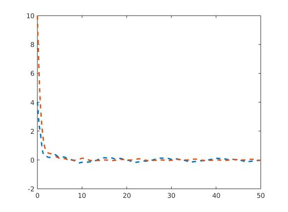 
* Control input plot 
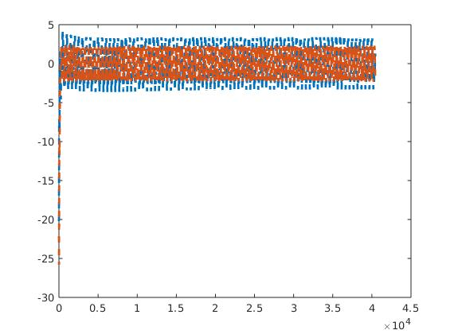 
* Plot of adaptive estimates 
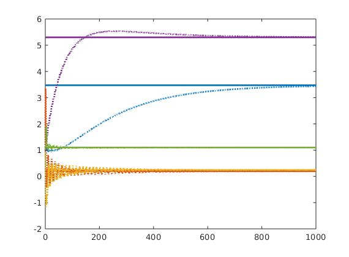 
* Plot of the parameter estimate errors() 
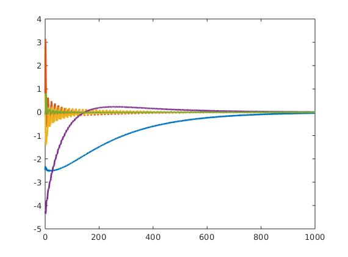 

**For the Composite adaptive controller with gredient adaptive update law:** 
* Control gain and their value:  
As for comparison, I use the same control gain as K = 5,  = 1.5,  = 1, and  .
* Tracking error plot for each link:  
For e: 
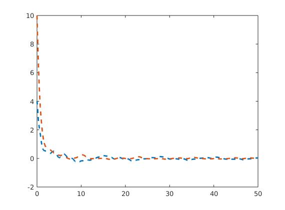 
* Control input plot 
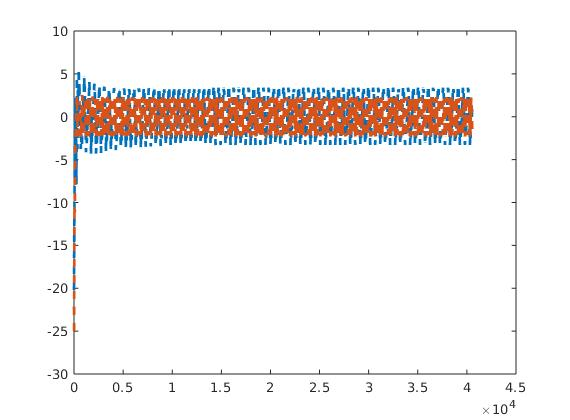 
* Plot of adaptive estimates 
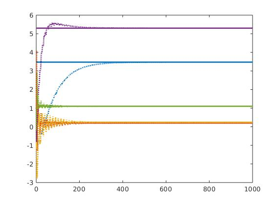 
* Plot of the parameter estimate errors() 
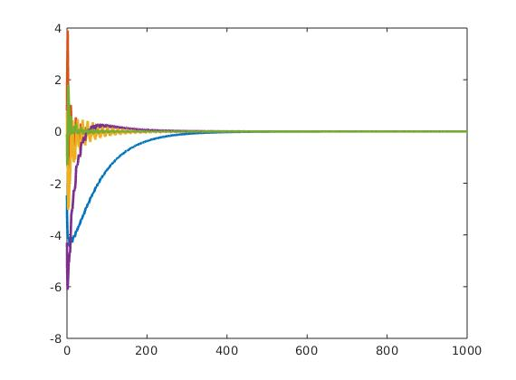 

**For the Composite adaptive controller with least squares adaptive update law:** 
* Control gain and their value:  
As for comparison, I use the same control gain as K = 5,  = 1.5,  = 1, and  .
* Tracking error plot for each link:  
For e: 
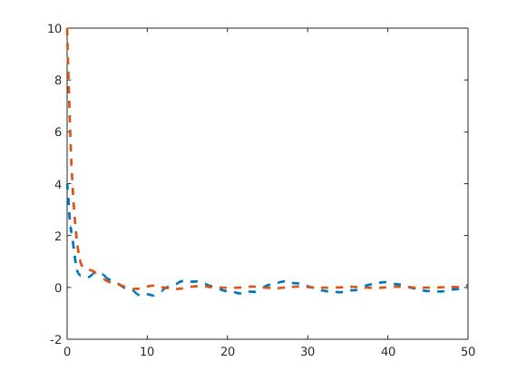 
* Control input plot 
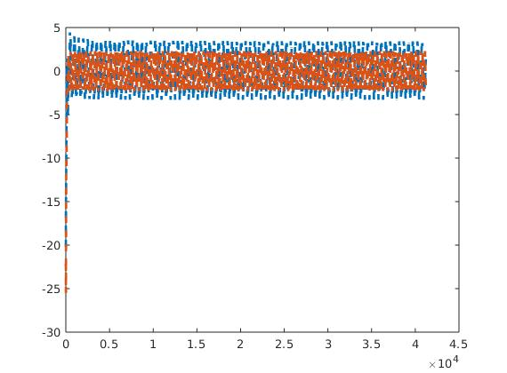 
* Plot of adaptive estimates 
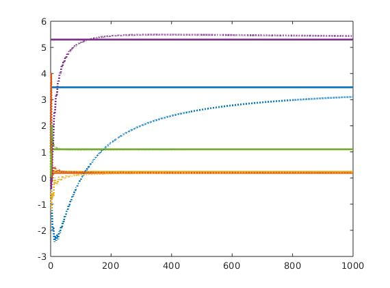 
* Plot of the parameter estimate errors() 
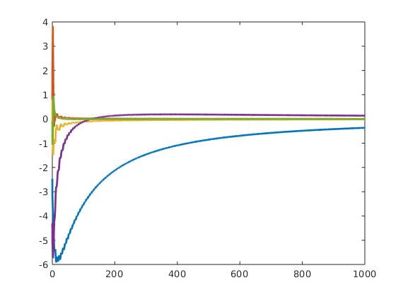 

**(f) Discution section:**

**1. Differences in tunning the control gains/adaptation gains.** 
When increasing control gain K, we can clearly notice that the tracking error would converge faster, but it slow down the convergence of parameter estimate errors, and when increasing adaptation gains &nbsp;  &nbsp;, tracking error would converge faster, and it may slow down the parameter estimate errors, I can see from my experiment that it suppress the overshoot of parameter estimate errors. When incresing the eigenvalue of the &nbsp;&nbsp;, it increase the convergence speed of both the tracking error and the parameter estimate errors, but I think it would increse the input value. 

**2. Performance of the tracking error for each controller.** 
I extract the first joint's tracking error from the 3 controller: 
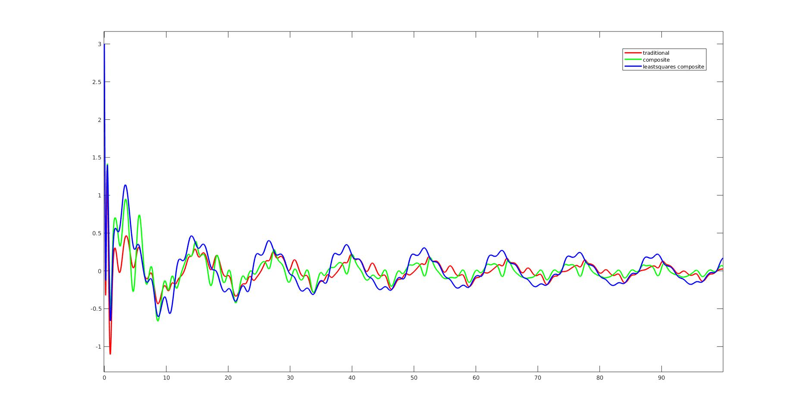 
Of the same control gain, I can see the traditional controller and the Composite adaptive controller with gredient adaptive update law have the similar performance, and the the Composite adaptive controller with least squares adaptive update law is not as good as the first two. However, overall their performance are not quite different.

**3. Performance of the adaptation for each case.** 
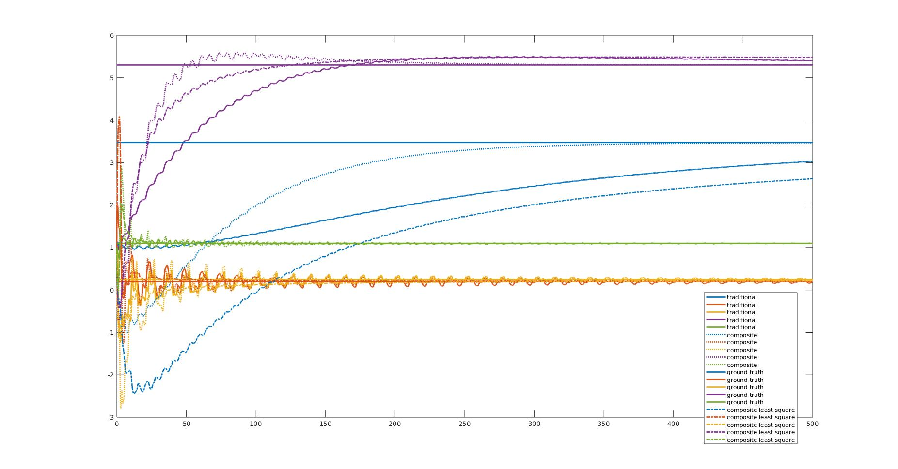 
For adaptation, the two composite controller both outperform the traditional one, but I can't see which one of these two can perform better that the other one. I think it's because they have different adaptation parameter as one using , and the other one has P0 which is initialized by us.

