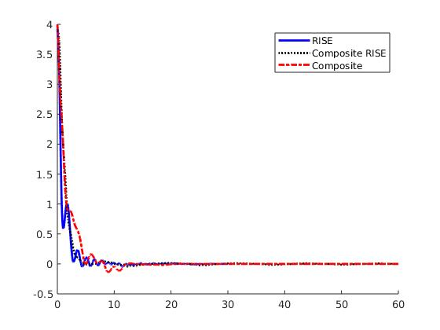

# EML 6351 Simulation Project 2 

* ## README

All my codes are inside the **src** folder. 
For assignment 1, the code for implementing a RISE controller is inside the **_traditional_Rise.m_** file, the file can be implemented directly in MATLAB. 
For assignment 2, the code for implementing a composite adaptive controller with a gradient update law is inside the **_Rise.m_** file, this file can be implemented directly in MATLAB too, but it may take longer time because the time step for ODE45 is small, and it takes much longer time to compute and retrieve the input &nbsp;  &nbsp;. 

-----------------------
* ## Discussion
* ### **(a) Dynamic Model** 

For this simulation project, the dynamic model is of a two-link rigid revolute root manipulator given by: 

 

where &nbsp; &nbsp;,&nbsp;&nbsp;,&nbsp;&nbsp;,&nbsp;&nbsp;&nbsp;&nbsp; are unknown positive scalar constant,&nbsp;&nbsp;,&nbsp;&nbsp;,&nbsp;&nbsp; and &nbsp;denote the control torque inputs on the first and second joint respectively. For the simulation, only&nbsp;&nbsp;and&nbsp;&nbsp;are assumed to be measurable. 

* ### **(b) Simulation Section** 

  * **RISE controller** 

    **1. Control gains.**  

    K = 10, a1 = 1.5, a2 = 1.5 and &nbsp;&nbsp; = 10. 

    **2. Tracking error plot for each link.** 

     

    **3. Control input plot for each link.**  

     

    **4. Plot of the adaptive estimates.** 
    **5. Plot of the parameter estimate errors** 
    Because we this time only implement the RISE controller without adaptive component, we don't have adaptive estimates here. 

  * **Composite adaptive controler with the additional RISE term** 

    **1. Control gains.** 

    K1 = 10, K2 = 25, &nbsp;&nbsp; = 1,&nbsp;&nbsp;=3,&nbsp;&nbsp; = 1, and 

    &nbsp;. 

    **2. Tracking error plot for each link.** 

     

    **3. Control input plot for each link.**  

     

    **4. Plot of the adaptive estimates.** 

     
     

    **5. Plot of the parameter estimate errors** 

     

  * **Standard composite adaptive controller** 

    **1. Control gains.** 

    K = 10, &nbsp;&nbsp; = 2,&nbsp;&nbsp; = 1, and 

    . 

     **2. Tracking error plot for each link.** 

      

     **3. Control input plot for each link.**  

      

     **4. Plot of the adaptive estimates.** 

      

     **5. Plot of the parameter estimate errors** 

      

* ### **(c) Discussion section** 

  * **Differences in tuning the control gains/adaptations** 

    For K1, K2 or K, when incresing those K, tracking error would decrease faser, but somehow the input would increase. 
    For &nbsp;&nbsp;, &nbsp;&nbsp; or &nbsp;&nbsp;, when increasing those &nbsp;&nbsp;, tracking error would decrease faster, but it somehow increases the input, and invokes bigger oscillation in the system. 
    For &nbsp; &nbsp;, when we increse &nbsp;&nbsp;, the tracking error would decrease faster, and the parameter estimate errors would dercrease faster as well. 
    For &nbsp; &nbsp;, it can somehow impact the adaptive estimation, when we modify the specific components inside &nbsp; &nbsp;, we can speed up some of the parameter estimations.

  * **Performance of the tracking error for each controller** 
    
    Below is the first channel of tracking error: 

     

    The second channel of the tracking error: 

     
    
    In my simulation, I set all the intialal error to the same values for the three controllers, and from the comparison of tracking error shown above, the RISE controller without Composite adaptive component has the best performance, and the composite adaptive controler with the additional RISE term is slightly outperform the standard composite adaptive controller.

  * **Performance of the adaptation for each case** 

    
 
    
Composite adaptive controller&nbsp;&nbsp;&nbsp;
 

     
    
Composite adaptive controller with with the additional RISE &nbsp;&nbsp;&nbsp;
 
    

    The interuption&nbsp;&nbsp; is small in this simulation. From the images above, I can conclude that in this situation, the standard composite adaptive controller has better performance of the adaptation. 

  * **For the above three discussion topics, be sure to compare and contrast the different results** 

    

