
  

 # EML 6351 Simulation Project 3 

  

* ## README 
  All my codes are inside the **src** folder. 
  * For assignment 1, the code for implementing a standard gradient based adaptive update law is inside the **_traditional.m_** file.
  * For assignment 2, the code for implementing a concurrent learning based adaptive update law is inside the **_CLmethod.m_** file.
  * For assignment 3, I designed 2 method to implement the intergral concurrent learning based adaptive update law. The codes are inside the **_ICLmethod.m_** and **_ICLmethod2.m_** file. These two files are independent and both can be implemented in MATLAB directly. 

-----------------------
* ## Discussion 
* ### **(a) Simulation Section** 
  * **Standard Gradient Based Adaptive Update Law** 
  
    **1. Control gains.**    

    k = 5;&nbsp;&nbsp;= 2;   

     

    **2. Tracking error plot for each link.**   

    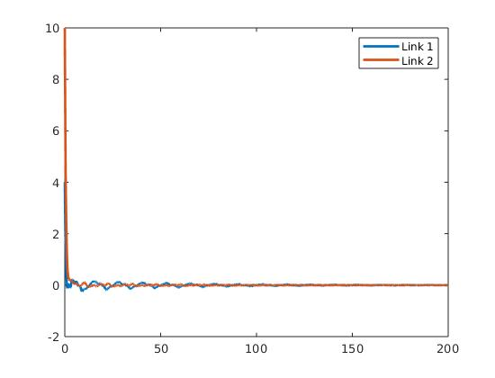   

    **3. Control input plot for each link.**   

    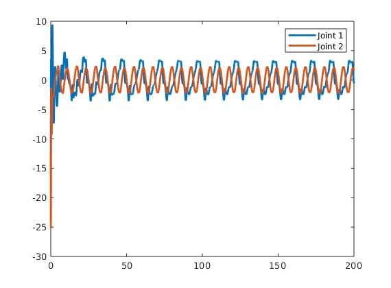   

    **4. Plot of the adaptive estimates.**    
    
    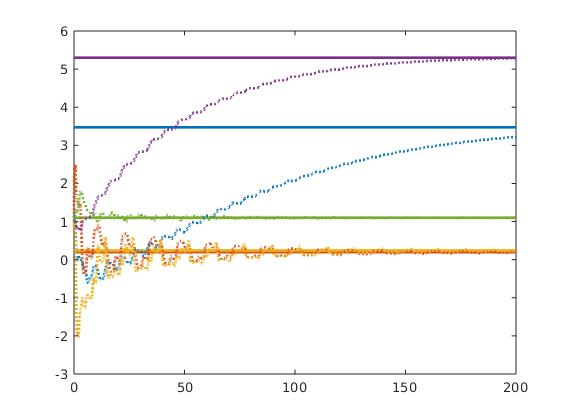   

    **5. Plot of the minimum eigenvalue of the &nbsp; &nbsp; summation.**    

    In this method, we don't compute eigenvalue for update law. 

    **6. Plot of the parameter estimate errors.**    

    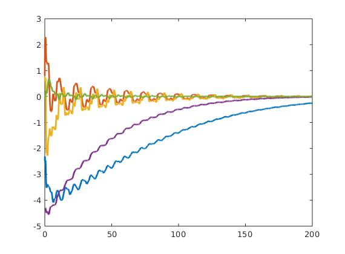   

  * **concurrent learning based adaptive update law**   
   
    **1. Control gains.**    

     k = 1; kcl = 10e-5;&nbsp;&nbsp;= 2; 

        

     And I set &nbsp;&nbsp;=1, as it will affect the simulation's performance.   

    **2. Tracking error plot for each link.** 

    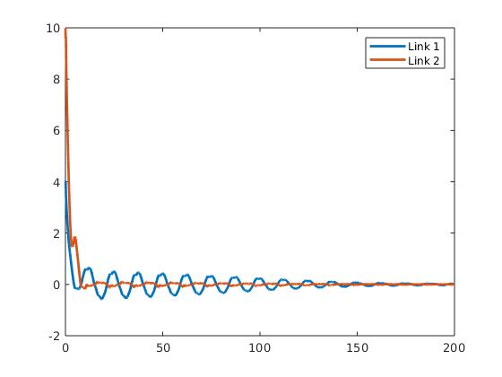   

    **3. Control input plot for each link.**   
     
    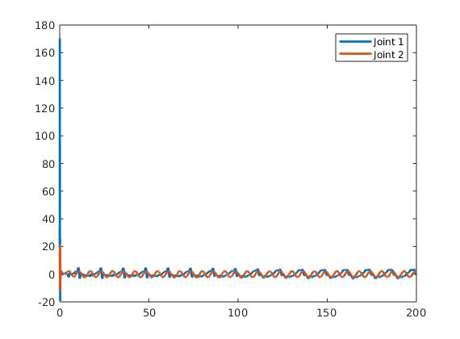   

    **4. Plot of the adaptive estimates.**    

    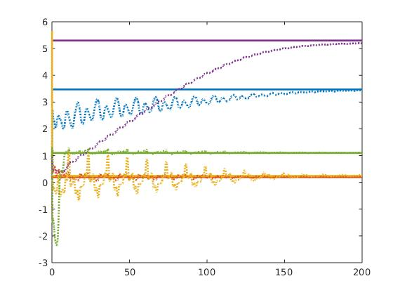   

    **5. Plot of the minimum eigenvalue of the &nbsp; &nbsp; summation.**  

    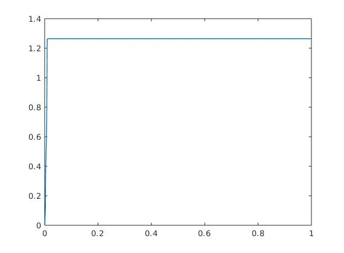   

    Once our ODE solver get the eigenvalue of the &nbsp; &nbsp; summation bigger than &nbsp;&nbsp;, we stop updating our Y1i history list thus it will remain till the simulation stops.

    **6. Plot of the parameter estimate errors.**    

    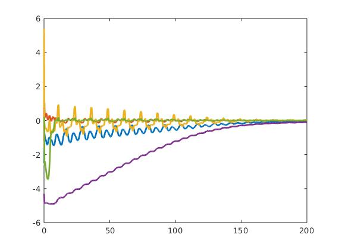   

  * **Integral concurrent learning based adaptive update law**   
  
    **1. Control gains.**    

    k = 1; kcl = 10e-5;&nbsp;&nbsp;= 2; 

        

     And I set &nbsp;&nbsp;=1, as it will affect the simulation's performance.   

    **2. Tracking error plot for each link.** 

    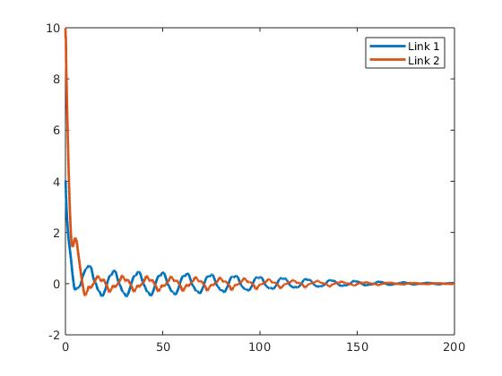   

    **3. Control input plot for each link.**   
     
    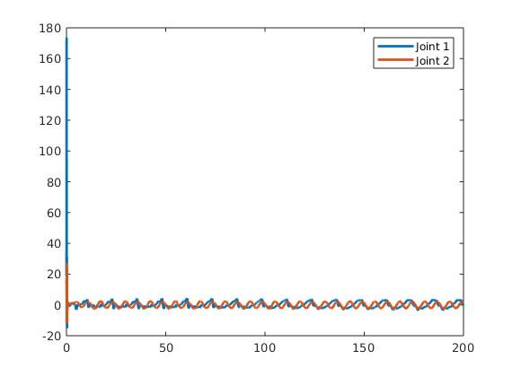   

    **4. Plot of the adaptive estimates.**    

    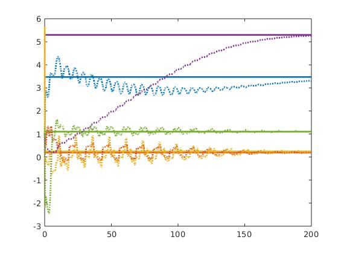   

    **5. Plot of the minimum eigenvalue of the &nbsp; &nbsp; summation.**  

    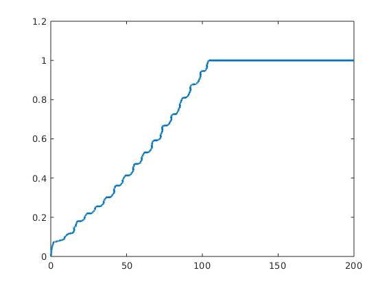   

    **6. Plot of the parameter estimate errors.**    

    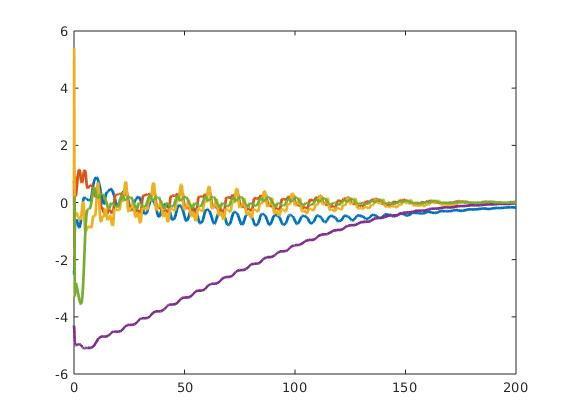   

* ### **(b) Discussion section** 
  
  * **Differences in tuning the control gains/adaptations**   
    
    From the analysis of lyapunov function, we can know that K (Kcl,Kicl) and &nbsp;&nbsp; can both affect the Convergence of the lyapunov function V. If&nbsp;&nbsp; is semi negative definite, those parameters can still affect the convergence of the tracking error.   

    In my simulation, I found that increasing K or &nbsp;&nbsp; can both make tracking error decrease faster, but increase the input as tradeoff, and in addition, when tracking error decrease faster, the convergence of the parameters estimate error will slow down. To get a better performance, I think we have to make K bigger than &nbsp;&nbsp;. As, &nbsp;&nbsp; would bring in oscillation in tracking error, and K can suppress the oscillation.   

    For parameter Kcl or Kicl, we have to set them properly in CL or ICL controllers, the parameters estimate error would converge when Kcl or Kicl are set properly. For my implementation, I found when I set Kcl to 10e-5, I can get a better convergence in parameters estimate error, and when Kicl is bellow 10e-7, I can get the best performance in the ICL simulation scenario. Below is a example of tunning Kcl. 

    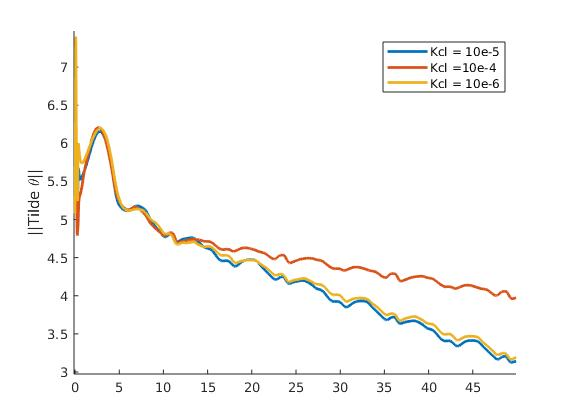   

    For comparing userdefined Delta T, I found it very difficult to implement in ODE45 solver, so I designed anouther method to compare them, and the results are as below:   

    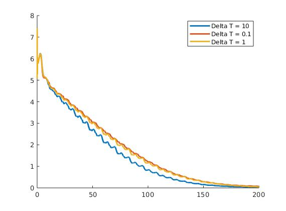   

    I think increasing Delta T can generally make better performance, as it can supress the noise, but we have to tune the Kicl at the same time in case that our &nbsp; &nbsp; summation become too large.   

    For &nbsp;&nbsp;, it can control the speed of the parameter estimate error convergence. In general, we can increase them to get faster parameter estimate convergence, however, in my opinion, I think we should just tune the diagonal element &nbsp;&nbsp;, because it's risky to add covariance in those parameter estimate.   

    For &nbsp;  &nbsp;, I think with bigger &nbsp;&nbsp;, we can have better convergence in parameter estimate error. Below is the comparison for scenario with different &nbsp;  &nbsp; but the same Kci: 
    
    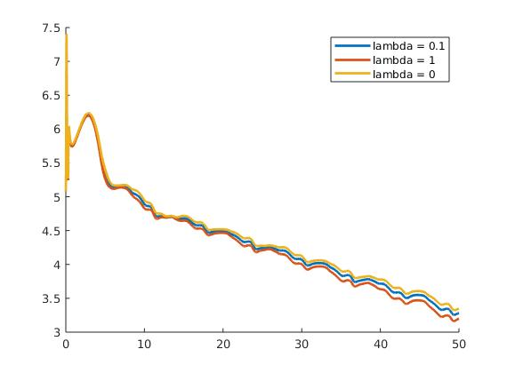   

  * **Performance of the tracking error for each controller** 
    
    I compared the &nbsp;&nbsp; generated from the 3 simulation using the 3 different controllers. The result is as below:   

     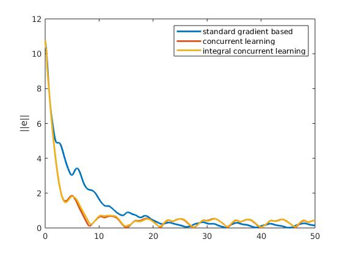   

     From the aespect of &nbsp;&nbsp;, I can not conclude that which controller is better. concurrent learning method and integral concurrent learning has the very same performance of the tracking error. I think that's because they have the very same structure of &nbsp; &nbsp; and the same &nbsp;&nbsp;.   

     From lyapunov analysis, we can infer that all the three &nbsp;&nbsp; would asymptotically converge to 0. So the results from the simulation are as expected.   

  * **Performance of the adaptation for each case** 
  
    Comparing the &nbsp;  &nbsp; form three simulation as below: 

    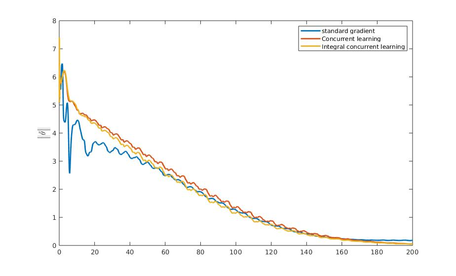   

    From lyapunov analysis, we only can infer that the estimate error of the standard gradient based adaptive update law is just bounded, but we can infer that the estimate errors of the other two method can exponentially converge to 0. At the beginning of the simulation, the estimate error of the standard gradient based adaptive update law outperfroms the other two methods, but at the end of the simulation, the performances of the CL and ICL method are better than the standard one. I think that's consistent with the lyapunov analysis, because it shows the error will converge to 0 in CL or ICL method.   

    However, I can't see much noise in the simulation of CL method, and the oscillation of estimate error behave very similar bettween ICL and CL method. I think that's because in my simulation, I only collect the first couple timesteps' data until we achieve our ideal minimum eigen value, then stop updating the datas. It makes us very hard to see the noisy signal. This is exactly what I want to improve in my simulation, the second thing I want to improve is the ODE method itself. Because I am using RK45 to simulate, that makes me very hard to collect exact timestep's data.

