
  

# EML 6351 Simulation Project 4 
## Implement a RISE-based modular controller

  

-------------------

* ## Simulate 4 different adaptive update law 
  
  To implemente 4 different adaptive update law, we have to moddify &nbsp;  &nbsp; while &nbsp;  &nbsp; and &nbsp;  &nbsp; satisfy the below conditions: 

  
  

   

  

  where:&nbsp;&nbsp;&nbsp;,&nbsp;&nbsp;; 
  And&nbsp;&nbsp;,&nbsp;&nbsp;. 

  

   

  

  where:&nbsp;&nbsp;&nbsp;,&nbsp;&nbsp;; 
  And&nbsp;&nbsp;,&nbsp;&nbsp;. 

  
  
  
  All the simulations are implemented with MATLAB, the ***.m** file can be found in the **src** folder. 

-----------------------
* ## Discussion 
* ### **(A) Simulation Section** 
  * **Adaptive Update Law with &nbsp;  &nbsp;** 
  
    **1. Control gains.**    

    In this case, I simply use sinusoidal as &nbsp;&nbsp;. 

    Control gains: ks = 10,&nbsp;&nbsp;,&nbsp;&nbsp;,&nbsp;&nbsp;. 

    **2. Tracking error plot for each link.**   

    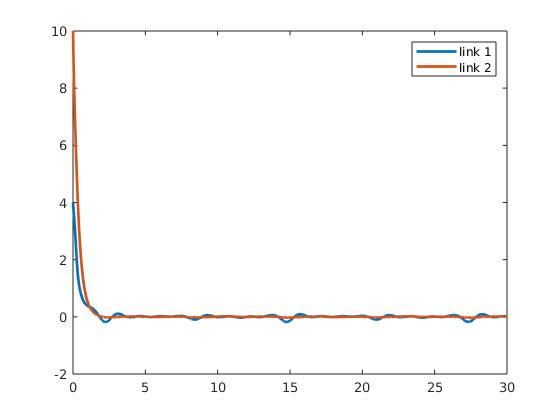   

    **3. Control input plot for each link.**   

    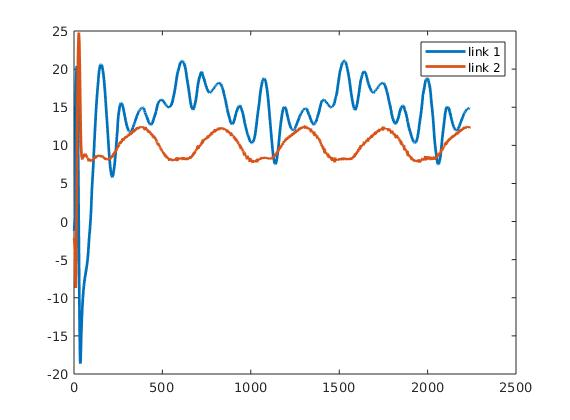 

    **4. Plot of the adaptive estimates.**    
    
    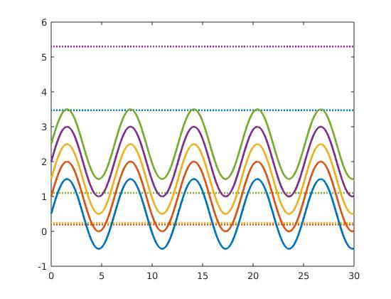 

    **5. Plot of the parameter estimate errors.**    

    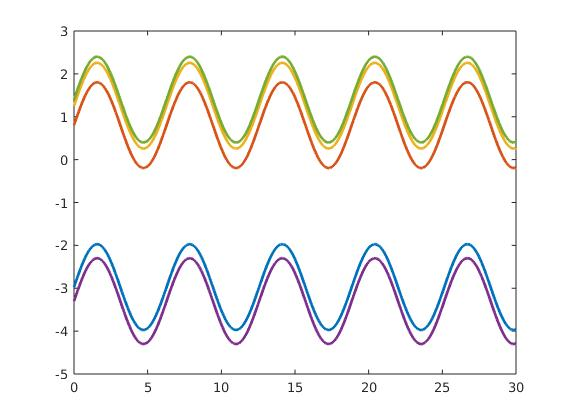 

  * **Adaptive Update Law with &nbsp;  &nbsp;** 
  
    **1. Control gains.**   

    In this case, I try to add some regulation terms to &nbsp;  &nbsp; just like the standard adaptive update law. 

    Control gains: ks = 10,&nbsp;&nbsp;,&nbsp;&nbsp;,&nbsp;&nbsp;; 

     

    **2. Tracking error plot for each link.**   

    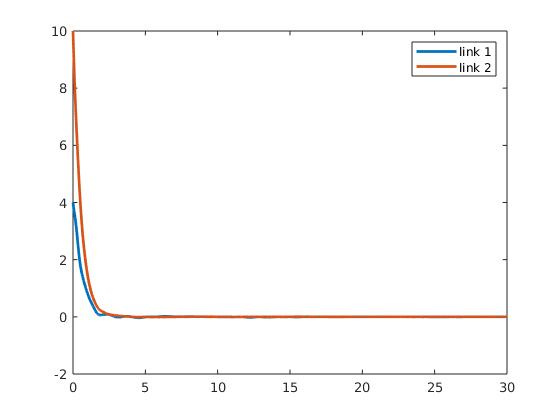   

    **3. Control input plot for each link.**   

    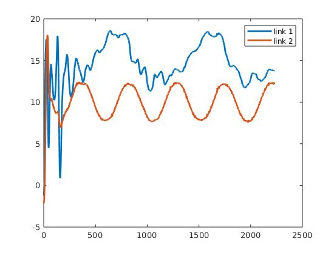 

    **4. Plot of the adaptive estimates.**    
    
    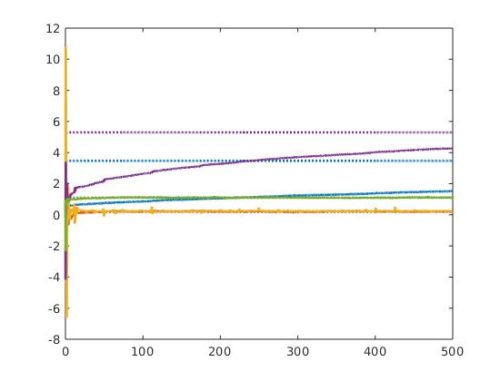 

    **5. Plot of the parameter estimate errors.**    

    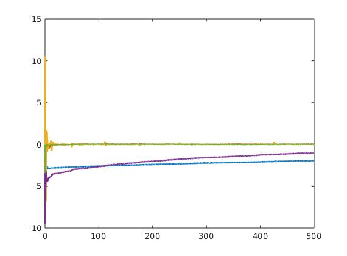 

  * **Adaptive Update Law with &nbsp;  &nbsp;** 
  
    **1. Control gains.**  

    In this case, I put all the error terms into the adaptive law. 

    Control gains: ks = 10,&nbsp;&nbsp;,&nbsp;&nbsp;,&nbsp;&nbsp;; 

     

    **2. Tracking error plot for each link.**   

    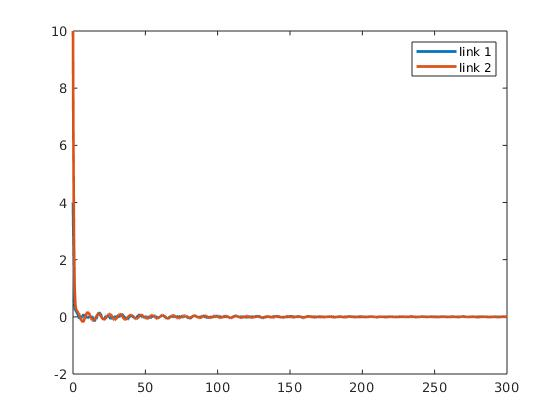  

    **3. Control input plot for each link.**   

    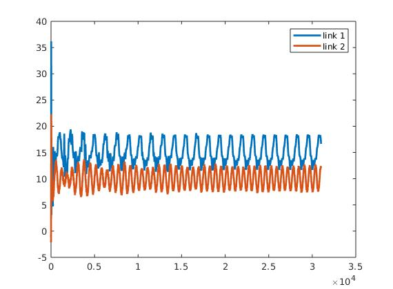 

    **4. Plot of the adaptive estimates.**    
    
    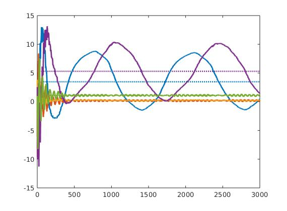 

    **5. Plot of the parameter estimate errors.**    

    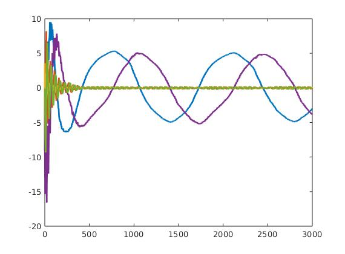 

  * **Adaptive Update Law with &nbsp;  &nbsp;** 

    **1. Control gains.**  
      
    In this case, I utilize &nbsp;  &nbsp;, and see how it work.

    Control gains: ks = 10,&nbsp;&nbsp;,&nbsp;&nbsp;,&nbsp;&nbsp;; 

     

    **2. Tracking error plot for each link.**   

    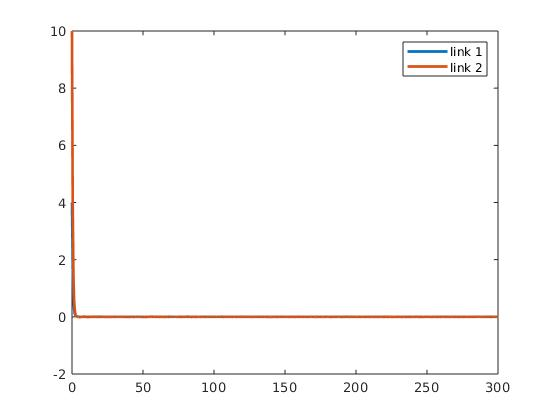 

    **3. Control input plot for each link.**   

    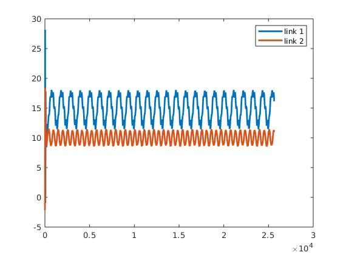 

    **4. Plot of the adaptive estimates.**    
    
    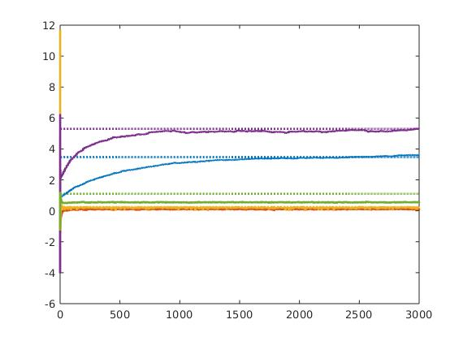 

    **5. Plot of the parameter estimate errors.**    

    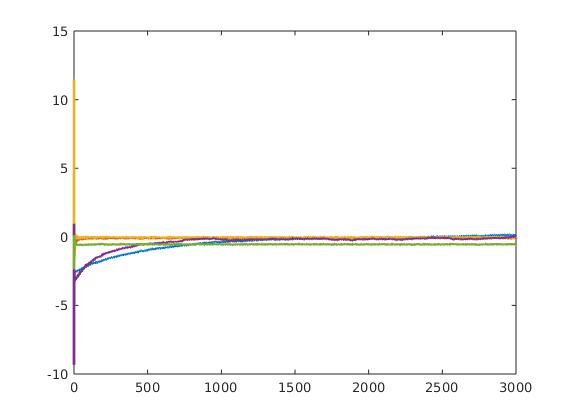 

* ### **(B) Discussion section** 
  
  * **Differences in tuning the control gains/adaptations**   
     
     As we are implementing a RISE-based modular controller, there could be many kinds of parameters can be twiddled in different kind of adaptation law. For my 4 implementation, there are mainly 5 gains/adaptations I can tune: &nbsp;&nbsp;,&nbsp;&nbsp;,&nbsp;&nbsp;,&nbsp;&nbsp;and &nbsp;&nbsp;. 

     Take the standard adaptive update law for example: 

      &nbsp; is a term to provide &nbsp; &nbsp; in the lyapunov analysis, and thus &nbsp;&nbsp; should be big enough to predominate other &nbsp;  &nbsp; which may come from Young's inequality and etc. As we increse &nbsp;  &nbsp; , the tracking error will converge faster, however, the input will increase and estimates error would converge much slower. I think that's a trade-off. 

      &nbsp; and &nbsp;  &nbsp; contribute the &nbsp;  &nbsp; in the lyapunov analysis. When incresing &nbsp;  &nbsp; and &nbsp;  &nbsp;, we have to increse &nbsp;  &nbsp; too, otherwise our simulation could break down. With bigger &nbsp;  &nbsp; and &nbsp;  &nbsp;, we will have  quicker convergence of both estimates error and tracking error. However, the input would increase. 

    Twiddling &nbsp;  &nbsp; can actually increase the speed of estimate error convergence. In my implementation, I found when &nbsp;  &nbsp; is small, then the estimate error would converge faster. 

    In my implementation, &nbsp;  &nbsp; is a matrix. It's a learning rate hyperparameter. When we modify the specific element in this matrix, we can increse or decrease the corresponding parameter's estimation estimates' changing rates. 

  * **Performance of the tracking error for each controller**   
    
    I compared the L2-norm of each controller's tracking error,&nbsp; &nbsp;, as shown below: 

    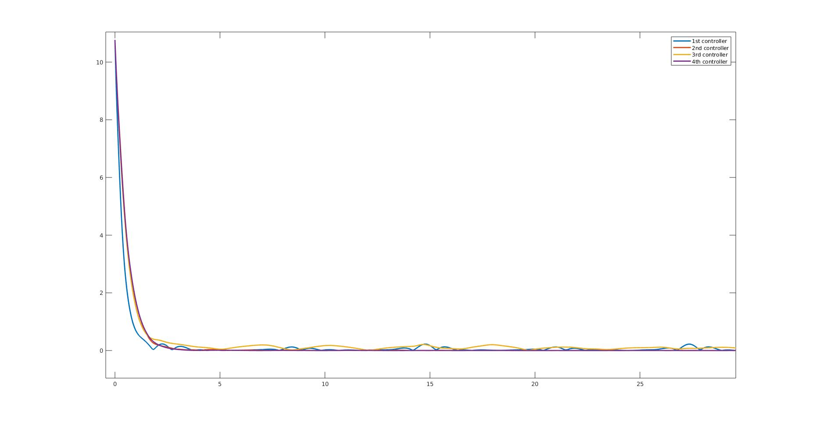 

    As I expected, all the contoller has good performance on the tracking error as RISE-based modular controller design is designed to achieve asymptotic tracking after all. In fact, the ones with DCAL and only &nbsp;  &nbsp; in it has better performance, the one uses random sinusoidal as adaptive update law has slightly worse performance (blue), and the one uses not only &nbsp;  &nbsp; but also &nbsp;  &nbsp; and &nbsp;  &nbsp; has the worst performance (yellow). 

  * **Performance of the adaptation for each case**  

    I compared the L2-norm of each controller's parameter estimation error,&nbsp;  &nbsp;, as shown below: 

    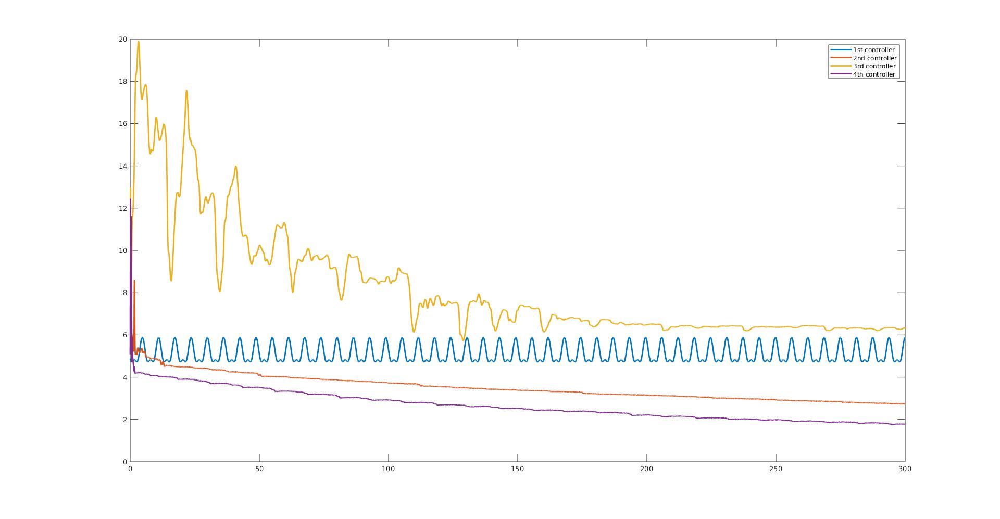 

    Among my 4 controllers, the one uses composite adaptive update structure has the best performance. However, I have not used prediction error in this contoller. The one use tradional gradient update law has slightly worse performance, but if we put all the error terms along with the DCAL term, the performance is worst. 

    From the result of adaptation and tracking error. I can see that in RISE-based modular controller, the adaptation and tracking error performance have positive correlation. The better adaptation performance we have, the better tracking performance our controller can achieve. 

    I think the modular method give us the possibility to twiddle our controller like PID controller, and the way we modify the adaptation law can make a huge difference in performance. The RISE-based method also get us the idea to put &nbsp;  &nbsp; in the &nbsp;  &nbsp; . 

    Things can be improved: I think I can compare my controllers to the composite adaptive controller with RISE-term in **Project 2**, and see if I can design a better controller using the modular method.

    
  