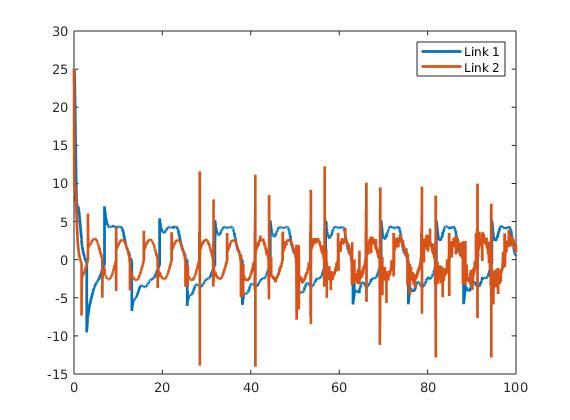

  

# EML 6351 Simulation Project 5 
## Implement a Repetitive Learning Controller (RLC)

-------------------------

## README 
  
1. All the codes are inside **src** file: 
   * The **traditional.m** file is for implementing the standard gradient based adaptive update law;  
    * The **RLC.m** file is for implementing the repetitive learning controller, and the **Sat.m** file is a function for implementing the saturation in the repetitive learning controller.  
  
## Dicussion 
* ### **(A) Simulation Section** 
    * **Standard Gradient Based Adaptive Update Law** 
  
        **1. Control gains.**  

        Control gains: &nbsp; &nbsp;, K = 5.  
        Adaptation gains: 

         

        **2. Tracking error plot for each link.** 

         

        **3. Control input plot for each link.** 

         

        **4. Plot of the adaptive estimates.**  

         

        **5. Plot of the parameter estimate errors.**   

         

        There are 7 paramters in this case, and I take the root sum square of them &nbsp;  &nbsp;. The result is shown below: 

         
         
         

    * **Repetitive Learning Controller** 
        
        **1. Control gains.**  

        Control gains: &nbsp; &nbsp;, K = 5,&nbsp;&nbsp;,&nbsp;&nbsp;. 
        Adaptation gains: 

         

        **2. Tracking error plot for each link.** 

         

        **3. Control input plot for each link.** 

         

        **4. Plot of the adaptive estimates.**  

         

        **5. Plot of the parameter estimate errors.**   

         

        The root sum square is as follow:

         
         
         

* ### **(B) Discussion section** 

  * **Differences in tuning the control gains/adaptations**   
    
    In my simulation, I found that increasing K or &nbsp;&nbsp; can both make tracking error decrease faster, but increase the input as tradeoff, and in addition, when tracking error decrease faster, the convergence of the parameters estimate error will slow down. To get a better performance, I think we have to make K bigger than &nbsp;&nbsp;. As, &nbsp;&nbsp; would bring in oscillation in tracking error, and K can suppress the oscillation. 

    For &nbsp;&nbsp;, it can control the speed of the parameter estimate error convergence. In general, we can increase them to get faster parameter estimate convergence, however, in my opinion, I think we should just tune the diagonal element &nbsp;&nbsp;, because it seems there are no reasons to add correlation in those parameter estimate, and we have to keep &nbsp;&nbsp; invertible.

    There are 2 more control gains in the repetitive learning controller,&nbsp;&nbsp; and &nbsp;&nbsp;. In Lyapunov analysis, we have: 

    
  

    

    
  
    Where:&nbsp; &nbsp;. 

    We know we should keep &nbsp;  &nbsp; big enough and keep &nbsp;  &nbsp; positive. In such way,  will be negative except when Z = 0.

    When I twiddle &nbsp;  &nbsp;, it seems it does not affect the performance. I think the reason would be the control gain K predominate &nbsp;  &nbsp; in my case. I have set &nbsp;   &nbsp; to a constant in my case, so there will be no difference between K and &nbsp;  &nbsp;. I try twiddling K, &nbsp;  &nbsp;, and &nbsp; &nbsp; all together. The conclusion is, the slower tracking error converge, the faster the parameter estimates can converge.

     &nbsp; is a control gain in &nbsp;  &nbsp;. When increasing it, tracking error converge faster and the oscillation is suppressed, but the input becomes bigger. But its affect is limited because of the saturation function we defined. In mu opinion, the bigger &nbsp;   &nbsp; we set for the saturation the more affect &nbsp;  &nbsp; can bring out.

  * **Performance of the tracking error for each controller**   
    
    I compare the &nbsp;  &nbsp; between the 2 controllers, the result is as follow: 

     

    From the comparison, I can see that their performance of the tracking error is pretty much the same, the controller with standard gradient based adaptive update law has more smooth tracking error convergence. The amplitudes of the high frequency components are smaller for it during the steady state. Other than that, it seems two controllers are pretty similar in their performance of the tracking error. 

  * **Performance of the adaptation for each case**  
    
    The parameters those two controllers try to estimate are different, I can only compare the parameters associated with static friction between those two controllers. In fact, both controllers use the same adaptation law for these two parameters, so I can assume that the performances are pretty similar, too. The result is shown below: 

     

    From the comparison above, I found that the controller with standard gradient based adaptive update law performs better than the RLC controller, but they both can not converge to 0 as the Lyapunov analysis shows. 

  * **Control effort for each case**  

    I compare the root sum square of the input between both cases, the result is as below: 

     

    From the figure above, I think the control efforts for both case are similar too. Although RLC controller does not have too much information about the dynamics, it can pretty much achieve the same performance as the controller with standard gradient based adaptive update law in the tracking error, and the control effort they need are similar too.