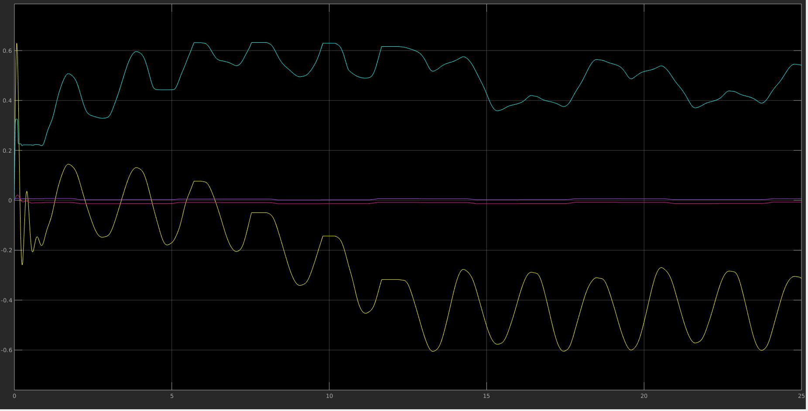

  

# EML 6351 Simulation Project 6 
## Implement Neural Network-based controller

-------------------------

## README 
  
1. All the codes are inside **src** file: 
   * The [**Neural_Networks_Continuous.m**](./src/Model_Composite_2Link_NN_Continuous.slx) file is for implementing with a neural network-based controller with a typical continuous feedback control law for the dynamics, along with the **Model_Composite_2Link_NN_Continuous.slx** file. 
   * The [**Neural_Networks.m**](./src/Model_Composite_2Link_NN.slx) file is for implementing with a neural network-based controller with a discontinuous sliding-mode feedback control law for the dynamics, along with the **Model_Composite_2Link_NN.slx** file. 
   *  The [**Neural_Networks_RISE.m**](./src/Model_Composite_2Link_NN_RISE.slx) file is for implementing with a neural network-based controller with a continuous RISE feed-back control law for the dynamics, along with the **Model_Composite_2Link_NN_RISE.slx** file. 
  
## Dicussion 
* ### **(A) Simulation Section** 
    * **neural network-based controller with a typical continuous feedback control law for the dynamics** 

        **1. Control gains.**  

        Control gains: &nbsp;  &nbsp; and &nbsp;  &nbsp;. 
        Neural Network learning rate: &nbsp;  &nbsp;. 

        **2. Tracking error plot for each link.** 

         
         

        Root Sum Squared of error is as below: 
         

        **3. Control input plot for each link.** 

         
         

        **4. Plot of the adaptive estimates.**  

        In this project, we don't explicitly estimate the parameters in dynamics. We use a FCNN architecture to estimate the dynamics in the system as shown below: 

         

        We use gaussian activation in the hidden layer, and no activation in the output layer.

         
         

        **5. Plot of the parameter estimate errors.**  

        In this project, we plot the errors between the FCNN output and the ground truth. 

         
         
         
         
    
    * **neural network-based controller with a discontinuous sliding-mode feedback control law for the dynamics** 

        **1. Control gains.**  

        Control gains: &nbsp;  &nbsp; and &nbsp;  &nbsp;. 
        Neural Network learning rate: &nbsp;  &nbsp;. 

        **2. Tracking error plot for each link.** 

         
         

        Root Sum Squared of error is as below: 
         

        **3. Control input plot for each link.** 

         
         

        **4. Plot of the adaptive estimates.**  

         
         

        **5. Plot of the parameter estimate errors.**  

        In this project, we plot the errors between the FCNN output and the ground truth. 

         
         
         
         

    * **neural network-based controller with a continuous RISE feed-back control law for the dynamics** 

        **1. Control gains.**  

        Control gains: &nbsp;  &nbsp; and &nbsp;  &nbsp;. 
        Neural Network learning rate: &nbsp;  &nbsp;. 

        **2. Tracking error plot for each link.** 

         
         

        Root Sum Squared of error is as below: 
         

        **3. Control input plot for each link.** 

         
         

        **4. Plot of the adaptive estimates.**  

         
         

        **5. Plot of the parameter estimate errors.**  

        In this project, we plot the errors between the FCNN output and the ground truth. 

         
         
         
             

* ### **(B) Discussion section** 

  * **Differences in tuning the control gains/adaptations**   

    For &nbsp;&nbsp;, it control the derivate of &nbsp;  &nbsp; and . However, after twiddling &nbsp;&nbsp;, I found that they don't effect the performance of my controller. I think the reason may be that the feedback part in the controller contribute the most effort, and it suppress the feedforward Neural Network part. &nbsp;  &nbsp; in 2 different sets of &nbsp;&nbsp; are shown below: 

    The first one is when &nbsp;  &nbsp;:
     

    The second one is when &nbsp;  &nbsp;:
     

    The saturation above is because we are using projection method, to prevent them being too large.

    For &nbsp;  &nbsp; , it is contained both in the Sliding mode term and RISE term, and it is essential in these two implementation. In both cases, only when &nbsp;  &nbsp; is big enough, we can conclude the asymptomatic tracking in the lyapunov analysis. But, when it become large, the control input would be oscilated and increased. I will show Slding mode controller as examples. 

     
     

    For &nbsp;  &nbsp; , it is contained both in our first continuous controller and the discontinuous controller (with Sliding mode control). We can sum them up and see them as a constant, they contribute a state squared part in the lyapunov analysis, and it's even more essential than the &nbsp;  &nbsp;. It determine if our tracking error would blow up. When we increse it, the tracking error would decrease faster, but we would increase the input effort as trade-off.

    For &nbsp;&nbsp; , it is demanded to be large enough in the Neural Netrok-based controller with RISE term. In the other two controllers, it can improve the convergence of the tracking error, but it also comes with a price as the input effort would be increased.

    For &nbsp;  &nbsp; in the Neural Netrok-based controller with RISE term, we knew that it should be big enough to conclude the Semi-GAT result, however, after I twiddling it, it seems it doesn't make a explicit effect on the perforamnce of the controller.

  * **Performance of the tracking error for each controller**   

     

    In the comparison above, we can know that in term of performance of the tracking error, the first controller with a typical continuous feedback control law behave the worst, and the other two has the similar performance. The neural network-based controller with a discontinuous sliding-mode feedback control law for the dynamics is slightly better than the neural network-based controller with a continuous RISE. But in my implementation, I use a fixed-step solver to deal with the discontinuous sliding-mode feedback, so it tends be inaccurate

  * **Performance of the adaptation for each case**  

    The parameter estimate errors are almost the same in these three cases, it seems that our feedback term has dominated the convergence. In my opinion, the neural network does not have meaningful interpretation given unsupervised learning. Although There is a feedback term &nbsp;  &nbsp; in the Neural Network update law, we are not using back propagation. In such way, we don't even have to do symmetric breaking, we initilize all the weights in the FCNN as 0. In my implementation the estimate errors very depends on the ground truth &nbsp;  &nbsp; .
    
  * **Control effort for each case**     
    
    In terms of control effort, the neural network-based controller with a discontinuous sliding-mode feedback control law for the dynamics behave the worst. So, I think the neural network-based controller with a continuous RISE feed-back control law for the dynamics is the best controller among the three. 

